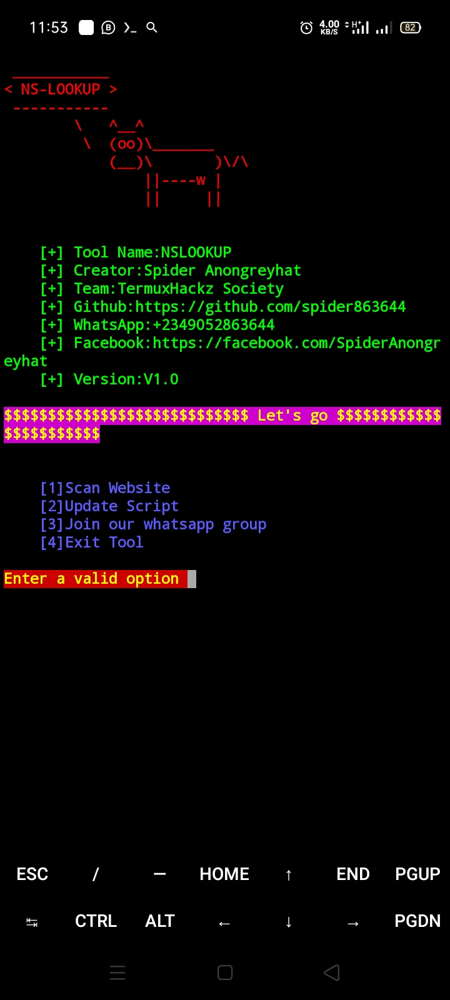
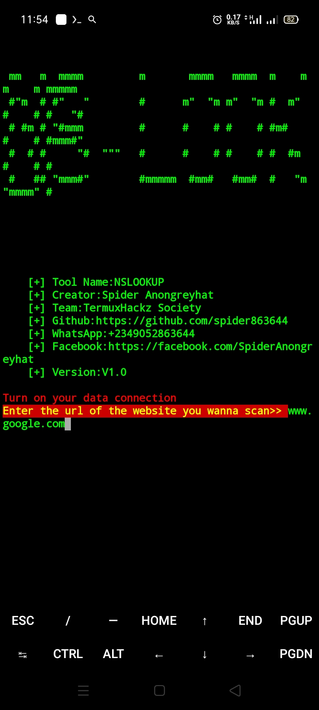

# NS-LOOKUP
A python script for scanning website for getting ip address of a website
<br>
It was created by Spider Anongreyhat

## Screenshots





## Installation for Linux
<b>Open Linux and type the following command below</b>
```
sudo apt update
sudo apt install python3
sudo apt install git
git clone https://github.com/spider863644/NS-LOOKUP
cd NS-LOOKUP
python3 nslookup.py


```

## Installation for Termux
<b>Open termux and type the following commands </b>
```
apt update
apt install git
apt install python3
git clone https://github.com/spider863644/NS-LOOKUP
cd NS-LOOKUP
python3 nslookup.py
```
### Instructions
Follow the terms and conditions<br>
Use "www.site.com" instead of using "https://site.com"

### Terms and Conditions
You agreed that you would be held responsible for any misuse of this script<br>
Use this script for educational purposes only

### Creator
Spider Anongreyhat

### Note:
If you face any issue when using this script kindly contact me on <a href="https://wa.me/2349052863644">WhatsApp</a>
<br>Also <a href="mailto: spideranongreyhat@gmail.com">email</a>

### Support Me
Kindly support this project by following me<br>
Star ⭐ this project
Folk this project
